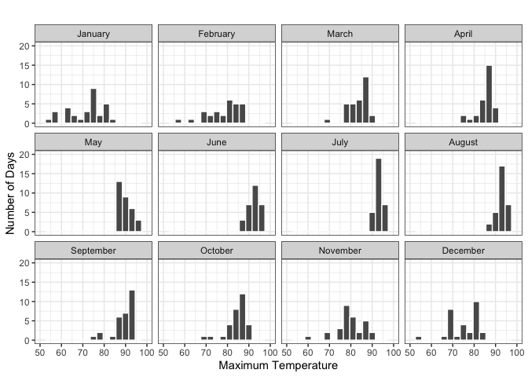
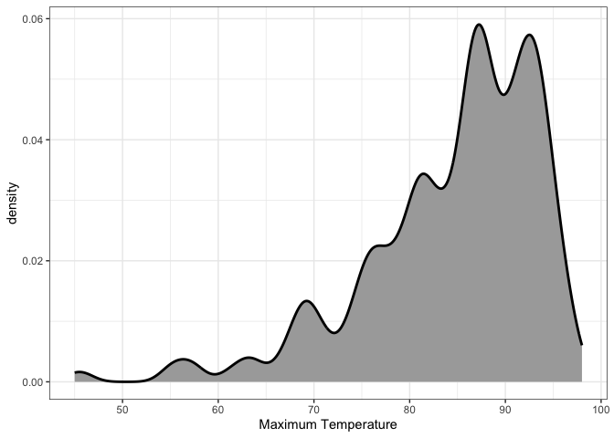
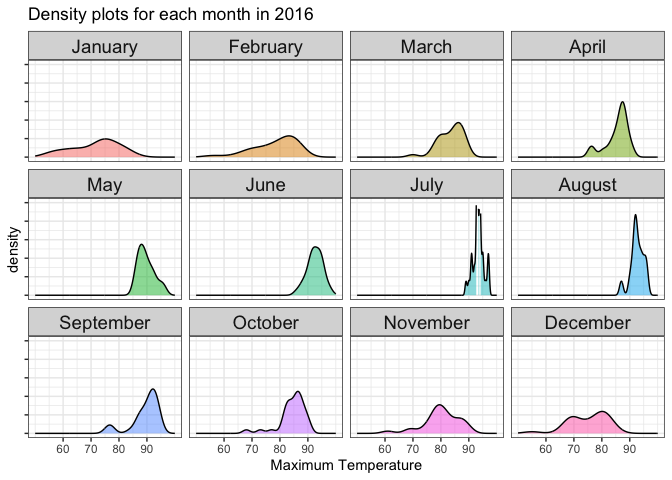
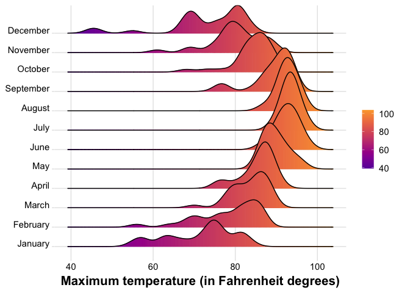
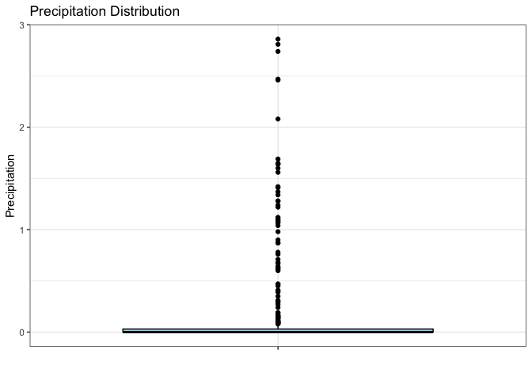
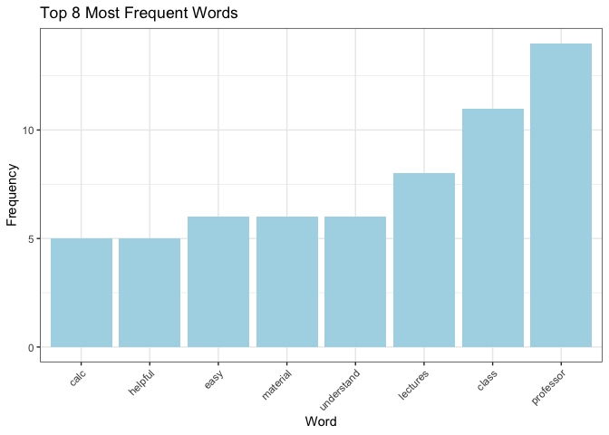

# Data Visualization Project 03


In this exercise you will explore methods to create different types of data visualizations (such as plotting text data, or exploring the distributions of continuous variables).


## PART 1: Density Plots

Using the dataset obtained from FSU's [Florida Climate Center](https://climatecenter.fsu.edu/climate-data-access-tools/downloadable-data), for a station at Tampa International Airport (TPA) for 2022, attempt to recreate the charts shown below which were generated using data from 2016. You can read the 2022 dataset using the code below: 


```r
library(tidyverse)
weather_tpa <- read_csv("https://raw.githubusercontent.com/reisanar/datasets/master/tpa_weather_2022.csv")
# random sample 
sample_n(weather_tpa, 4)
```

```
## # A tibble: 4 × 7
##    year month   day precipitation max_temp min_temp ave_temp
##   <dbl> <dbl> <dbl>         <dbl>    <dbl>    <dbl>    <dbl>
## 1  2022     6     5       0             91       75     83  
## 2  2022     9    26       0.00001       93       76     84.5
## 3  2022    12     4       0             80       61     70.5
## 4  2022     5    13       0             86       70     78
```

See https://www.reisanar.com/slides/relationships-models#10 for a reminder on how to use this type of dataset with the `lubridate` package for dates and times (example included in the slides uses data from 2016).

Using the 2022 data: 

(a) Create a plot like the one below:


```r
months <- c('January', 'February', 'March', 'April', 'May', 'June',
                 'July', 'August', 'September', 'October', 'November', 'December')

# Convert Month column to a factor with month names as labels
weather_tpa$month <- factor(weather_tpa$month, levels = 1:12, labels = months)

weather_tpa_avg_temp <- weather_tpa %>% 
  group_by(month) %>% 
  summarize(
    average_temp = mean(ave_temp)
  )

weather_tpa <- merge(weather_tpa, weather_tpa_avg_temp, by = "month", all.x = TRUE)

ggplot(weather_tpa, aes(x = max_temp)) +
  geom_histogram(binwidth = 3, position = "dodge", color = "white") +
  facet_wrap(~ month, nrow = 3, ncol = 4) +
  labs(title = '', x = 'Maximum Temperature', y = 'Number of Days') +
  theme_bw() +
  ylim(0, 20) +
  scale_x_continuous(limits = c(50, 100))
```

```
## Warning: Removed 2 rows containing non-finite values (`stat_bin()`).
```

```
## Warning: Removed 24 rows containing missing values (`geom_bar()`).
```

<!-- -->

Hint: the option `binwidth = 3` was used with the `geom_histogram()` function.

(b) Create a plot like the one below:


```r
ggplot(weather_tpa, aes(x = max_temp)) +
  geom_density(adjust = 0.5, color = "black", size = 1, fill = "darkgrey") +
  labs(x = 'Maximum Temperature', y = 'density') + theme_bw()
```

```
## Warning: Using `size` aesthetic for lines was deprecated in ggplot2 3.4.0.
## ℹ Please use `linewidth` instead.
## This warning is displayed once every 8 hours.
## Call `lifecycle::last_lifecycle_warnings()` to see where this warning was
## generated.
```

<!-- -->

Hint: check the `kernel` parameter of the `geom_density()` function, and use `bw = 0.5`.

(c) Create a plot like the one below:


```r
# Create density plots for each month
ggplot(weather_tpa, aes(x = max_temp, fill = factor(month))) +
  geom_density(alpha = 0.5, color = "black") +
  facet_wrap(~ month, nrow = 3, ncol = 4, strip.position = "top") +
  labs(title = 'Density plots for each month in 2016', x = 'Maximum Temperature') +
  theme_bw() +
  theme(legend.text = NULL, legend.position = "none", strip.text = element_text(size = 14)) +
  scale_x_continuous(limits = c(50, 100), breaks = seq(60, 90, by = 10)) +
  scale_y_continuous(limits = c(0, 0.25), breaks = seq(0, 0.25, by = 0.05), labels = seq(0, 0.25, by = 0.05) +
  scale_fill_gradient(low = "yellow", high = "purple"))
```

```
## Warning: Removed 2 rows containing non-finite values (`stat_density()`).
```

<!-- -->

Hint: default options for `geom_density()` were used. 

(d) Generate a plot like the chart below:


```r
knitr::include_graphics("https://github.com/reisanar/figs/raw/master/tpa_max_temps_ridges_plasma.png")
```

<!-- -->


```r
library(ggplot2)
library(ggridges)
library(viridis)
```

```
## Loading required package: viridisLite
```

```r
density_plot <- ggplot(
  weather_tpa, 
  aes(x = max_temp, y = month, fill = stat(x))) +
  geom_density_ridges_gradient(
    scale = 3,
    color = "black",
    gradient_lwd = 1,
    gradient_lwd_follow_density = TRUE,
    gradient_low = "purple",
    gradient_high = "yellow",
    quantiles = c(0.5),
    quantile_lwd = 1,
    quantile_color = "black"
  ) +
  scale_fill_viridis_c(
    name = "",
    option = "plasma",
    begin = 0.2, end = 0.8
  ) +
  labs(caption = "Maximum temperature (in Fahrenheit degrees)") +
  theme_ridges(font_size = 13, grid = TRUE) +
  theme(
    axis.title.y = element_blank(),
    axis.title.x = element_blank(),
    plot.caption = element_text(hjust = 0.5, size = rel(1.2), face = "bold")
  )
```

```
## Warning in geom_density_ridges_gradient(scale = 3, color = "black", gradient_lwd = 1, : Ignoring unknown parameters: `gradient_lwd_follow_density`, `gradient_low`,
## `gradient_high`, `quantile_lwd`, and `quantile_colour`
```

```r
density_plot
```

```
## Warning: `stat(x)` was deprecated in ggplot2 3.4.0.
## ℹ Please use `after_stat(x)` instead.
## This warning is displayed once every 8 hours.
## Call `lifecycle::last_lifecycle_warnings()` to see where this warning was
## generated.
```

```
## Picking joint bandwidth of 1.93
```

<!-- -->


Hint: use the`{ggridges}` package, and the `geom_density_ridges()` function paying close attention to the `quantile_lines` and `quantiles` parameters. The plot above uses the `plasma` option (color scale) for the _viridis_ palette.


(e) Create a plot of your choice that uses the attribute for precipitation _(values of -99.9 for temperature or -99.99 for precipitation represent missing data)_.


```r
library(ggplot2)


filtered_weather <- weather_tpa %>%
  filter(precipitation != -99.99)

precipitation_plot <- ggplot(filtered_weather, aes(x = "", y = precipitation)) +
  geom_boxplot(color = "black", fill = "lightblue") +
  labs(title = "Precipitation Distribution", x = "", y = "Precipitation") +
  theme_bw()

precipitation_plot
```

<!-- -->


## PART 2 

> **You can choose to work on either Option (A) or Option (B)**. Remove from this template the option you decided not to work on. 


### Option (A): Visualizing Text Data

Review the set of slides (and additional resources linked in it) for visualizing text data: https://www.reisanar.com/slides/text-viz#1

Choose any dataset with text data, and create at least one visualization with it. For example, you can create a frequency count of most used bigrams, a sentiment analysis of the text data, a network visualization of terms commonly used together, and/or a visualization of a topic modeling approach to the problem of identifying words/documents associated to different topics in the text data you decide to use. 

Make sure to include a copy of the dataset in the `data/` folder, and reference your sources if different from the ones listed below:

- [Billboard Top 100 Lyrics](https://github.com/reisanar/datasets/blob/master/BB_top100_2015.csv)

- [RateMyProfessors comments](https://github.com/reisanar/datasets/blob/master/rmp_wit_comments.csv)

- [FL Poly News Articles](https://github.com/reisanar/datasets/blob/master/flpoly_news_SP23.csv)


(to get the "raw" data from any of the links listed above, simply click on the `raw` button of the GitHub page and copy the URL to be able to read it in your computer using the `read_csv()` function)


```r
#install.packages("tidytext")
library(tidytext)
rmp<- read_csv("https://github.com/reisanar/datasets/blob/master/rmp_wit_comments.csv")
```

```
## Warning: One or more parsing issues, call `problems()` on your data frame for details,
## e.g.:
##   dat <- vroom(...)
##   problems(dat)
```

```
## Rows: 1317 Columns: 1
## ── Column specification ────────────────────────────────────────────────────────
## Delimiter: ","
## chr (1): <!DOCTYPE html>
## 
## ℹ Use `spec()` to retrieve the full column specification for this data.
## ℹ Specify the column types or set `show_col_types = FALSE` to quiet this message.
```


```r
# install.packages("tidytext")
library(tidytext)

rmp <- read_csv("https://github.com/reisanar/datasets/raw/master/rmp_wit_comments.csv")
```

```
## Rows: 18 Columns: 2
## ── Column specification ────────────────────────────────────────────────────────
## Delimiter: ","
## chr (2): course, comments
## 
## ℹ Use `spec()` to retrieve the full column specification for this data.
## ℹ Specify the column types or set `show_col_types = FALSE` to quiet this message.
```

```r
data(stop_words)

rmp_stop <- rmp %>%
  unnest_tokens(output = "word", input = comments) %>%
  anti_join(stop_words)
```

```
## Joining with `by = join_by(word)`
```

```r
rmp_top <- rmp_stop %>% 
  count(word, sort = TRUE) %>% 
  head(8)

# Plot the results
ggplot(rmp_top, aes(x = reorder(word, n), y = n)) +
  geom_bar(stat = "identity", fill = "lightblue") +
  labs(title = "Top 8 Most Frequent Words", x = "Word", y = "Frequency") +
  theme_bw() +
  theme(axis.text.x = element_text(angle = 45, hjust = 1))
```

<!-- -->
